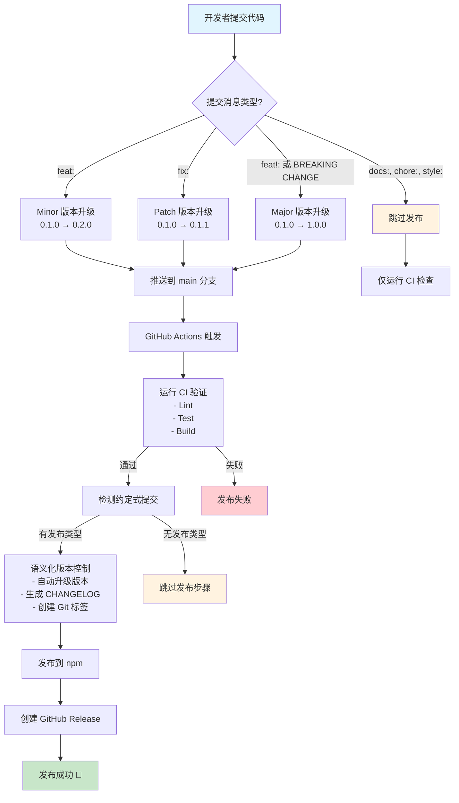

# 🚀 发布指南

本项目使用自动化的语义版本控制和发布流程，基于 [约定式提交](https://www.conventionalcommits.org/) 和 [release-it](https://github.com/release-it/release-it)。

## ✨ 自动发布流程



### 🎯 完全自动化发布（推荐）

只需三步即可自动发布新版本：

1. **📝 提交更改**，遵循约定式提交格式：

   ```bash
   # 新功能 (minor version: 0.1.0 → 0.2.0)
   git commit -m "feat: add configuration hot reload support"

   # 错误修复 (patch version: 0.1.0 → 0.1.1)
   git commit -m "fix: resolve memory leak in cache module"

   # 破坏性更改 (major version: 0.1.0 → 1.0.0)
   git commit -m "feat!: redesign API interface"

   # 文档更新 (不会触发发布)
   git commit -m "docs: update installation guide"
   ```

2. **🚀 推送到主分支**：

   ```bash
   git push origin main
   ```

3. **🤖 GitHub Actions 自动执行**：
   - ✅ 运行 CI 测试和构建验证
   - 📊 分析提交消息确定版本类型
   - 🔄 自动升级版本号
   - 📝 生成变更日志
   - 🏷️ 创建 Git 标签
   - 📦 发布到 npm
   - 🎉 创建 GitHub 发布

### 🎛️ 版本升级规则

基于约定式提交自动确定版本升级：

| 提交类型                    | 示例                     | 版本升级                  | 说明           |
| --------------------------- | ------------------------ | ------------------------- | -------------- |
| `feat:`                     | `feat: add new API`      | **Minor** (0.1.0 → 0.2.0) | 新功能         |
| `fix:`                      | `fix: resolve bug`       | **Patch** (0.1.0 → 0.1.1) | 错误修复       |
| `feat!:`                    | `feat!: breaking change` | **Major** (0.1.0 → 1.0.0) | 破坏性更改     |
| `BREAKING CHANGE:`          | 提交正文包含此标记       | **Major** (0.1.0 → 1.0.0) | 破坏性更改     |
| `docs:`, `style:`, `chore:` | 其他类型                 | **跳过发布**              | 不触发版本发布 |

### 📋 智能发布检测

系统会自动检测提交消息：

- ✅ **触发发布**：`feat:`、`fix:`、`perf:`、破坏性更改
- ⏭️ **跳过发布**：`docs:`、`style:`、`chore:`、`test:`、`refactor:`

## ⚙️ 设置指南

### 🔐 必需的 GitHub Secrets

在 GitHub 仓库设置中添加以下密钥：

1. **前往仓库设置**：`Settings` → `Secrets and variables` → `Actions`

2. **添加 NPM_TOKEN**：

   ```bash
   # 在本地生成 npm token
   npm login
   npm token create --access public --read-write
   ```

   复制生成的 token 并添加为 `NPM_TOKEN` secret

3. **GITHUB_TOKEN** 由 GitHub Actions 自动提供，无需手动设置

### 🛠️ 手动发布（备用选项）

如需手动控制发布流程：

#### 📋 试运行（预览）

```bash
pnpm release:dry
```

#### 🎛️ 交互式发布

```bash
pnpm release
```

#### 🤖 CI 发布（非交互式）

```bash
pnpm release:ci
```

### 📁 项目配置

#### Release-it 配置 (`.release-it.json`)

- **Git**：自动提交、打标签和推送
- **npm**：公开访问权限发布到 npm registry
- **GitHub**：创建带有自动生成说明的发布
- **变更日志**：使用 Angular 约定式变更日志格式
- **钩子**：发布前自动运行 lint、test、build

## 📝 约定式提交格式

遵循 [约定式提交](https://www.conventionalcommits.org/) 规范：

```
<类型>[可选作用域]: <描述>

[可选正文]

[可选脚注]
```

### 🏷️ 提交类型

| 类型       | 说明       | 版本影响 |
| ---------- | ---------- | -------- |
| `feat`     | 新功能     | Minor    |
| `fix`      | 错误修复   | Patch    |
| `docs`     | 文档更改   | 跳过     |
| `style`    | 代码格式化 | 跳过     |
| `refactor` | 重构代码   | 跳过     |
| `perf`     | 性能优化   | Patch    |
| `test`     | 测试相关   | 跳过     |
| `chore`    | 构建/工具  | 跳过     |

### 📚 提交示例

```bash
# ✅ 触发发布的提交
feat: add configuration hot reload support
feat(cache): implement Redis cache adapter
fix: resolve memory leak in service discovery
fix(config): handle malformed YAML files properly
perf: optimize nacos client connection pooling

# ⏭️ 不触发发布的提交
docs: update API documentation
style: format code with prettier
chore: upgrade typescript to v5.0
test: add unit tests for config parser
refactor: extract common utilities

# 🚨 破坏性更改 (Major 版本)
feat!: redesign configuration API
fix!: change service registration interface

feat: add new feature

BREAKING CHANGE: The `register` method signature has changed
```

## 🔧 故障排除

### ❌ 常见问题

#### 1. GitHub Token 权限错误

```bash
# 确保 GITHUB_TOKEN 有以下权限：
# - contents: write
# - issues: write
# - pull-requests: write
# - id-token: write
```

#### 2. NPM 发布失败

```bash
# 检查 NPM token 权限
npm whoami
npm token list

# 验证包名可用性
npm info cl-nestjs-nacos
```

#### 3. 工作目录不干净

```bash
# 清理工作目录
git status
git add .
git commit -m "chore: prepare for release"
```

#### 4. 版本已存在

```bash
# 检查现有版本
npm view cl-nestjs-nacos versions --json
git tag -l
```

### 🔍 调试发布流程

#### 本地测试发布

```bash
# 干运行模式，查看将要执行的操作
pnpm release:dry

# 检查约定式提交解析
npx conventional-recommended-bump -p angular
```

#### 查看 GitHub Actions 日志

1. 前往 `Actions` 标签页
2. 点击失败的 workflow
3. 查看详细日志输出

### 🆘 紧急恢复

#### 撤销错误的发布

```bash
# 撤销 npm 发布（仅在发布后 72 小时内）
npm unpublish cl-nestjs-nacos@<version>

# 删除 Git 标签
git tag -d v<version>
git push origin :refs/tags/v<version>

# 删除 GitHub 发布
# 需要手动在 GitHub 界面删除
```

## 📋 发布检查清单

发布前请确认：

- [ ] 所有测试通过 (`pnpm test`)
- [ ] 代码已经过 lint 检查 (`pnpm lint`)
- [ ] 构建成功 (`pnpm build`)
- [ ] 提交消息遵循约定式提交格式
- [ ] `NPM_TOKEN` secret 已正确设置
- [ ] 工作目录干净，无未提交更改

## 🔗 相关链接

- [约定式提交](https://www.conventionalcommits.org/)
- [语义化版本](https://semver.org/)
- [release-it 文档](https://github.com/release-it/release-it)
- [GitHub Actions 文档](https://docs.github.com/en/actions)
